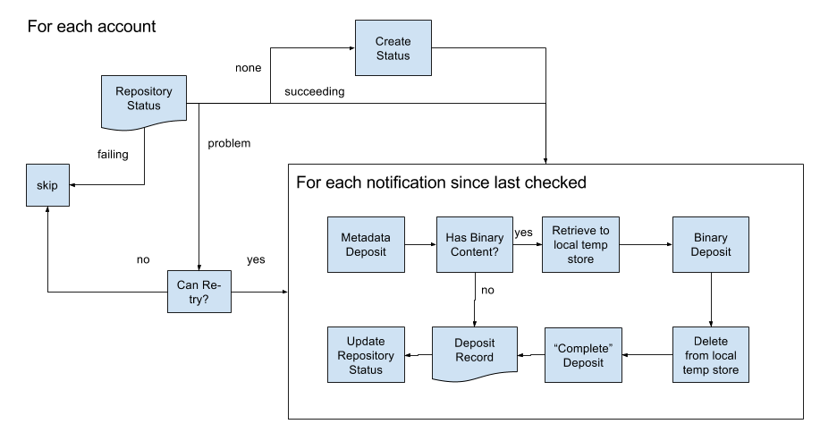

# SWORD-Out
## Contents
* Router [set-up & deposit process](./REPOSITORY.md) for SWORD-Out 
* SWORD2 [deposit protocol detail](./SWORD.md)
* XML output formats:
  * [DSpace vanilla XML](./DSpace-XML.md)
  * [DSpace RIOXX XML](./DSpace-RIOXX-XML.md)
  * [Eprints vanilla XML](./EPrints-XML.md)
  * [Eprints RIOXX XML](./EPrints-RIOXX-XML.md)
* [Output XML XSD](./pubrouter-xsd/README.md) specifications.

## SWORDv2 Deposit Client

This process consumes routed notifications on behalf of a repository and then re-packages the 
content as a SWORDv2 deposit which is then delivered to the repository in upto 3 steps:
* Metadata deposit, which creates the repository record
* Content deposit, which adds content file(s) to the repository record
* Complete deposit, which _tells_ the repository that the deposit is complete.

The overall workflow that the Deposit Client executes is as follows:

This directory contains information about the following features

* The Data Models: These are the core model objects which represent the information persisted by the deposit client

* The SWORDv2 protocol operations: this application implements a sub-set of the full list of SWORDv2 protocol operations

* Metadata Crosswalk: the transformation from the JPER notification metadata JSON format to the XML format to be sent to the repositories.
